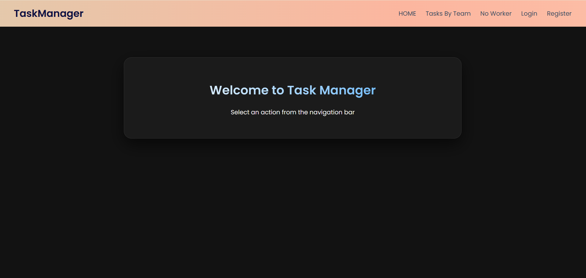
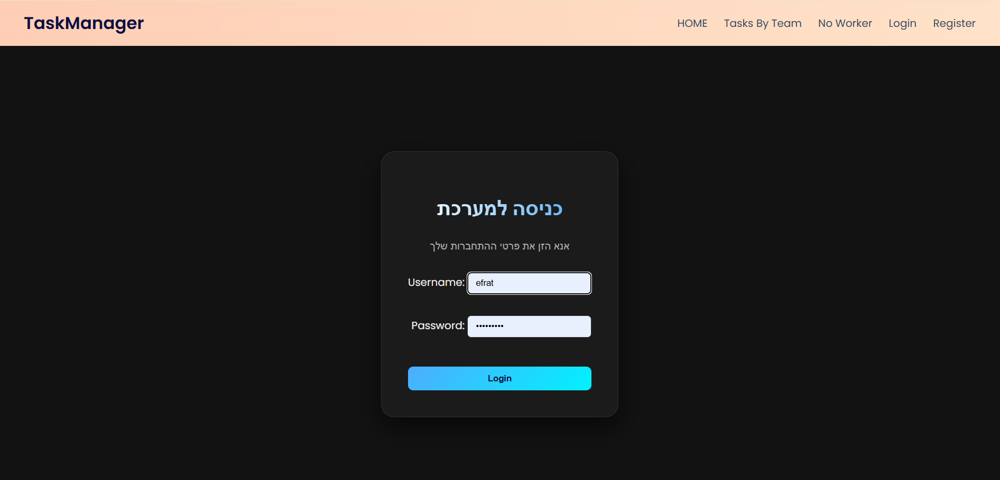
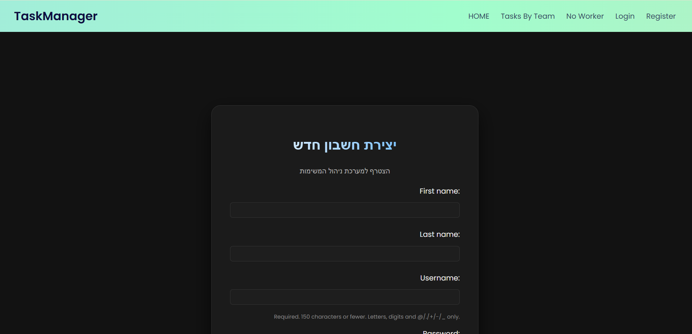
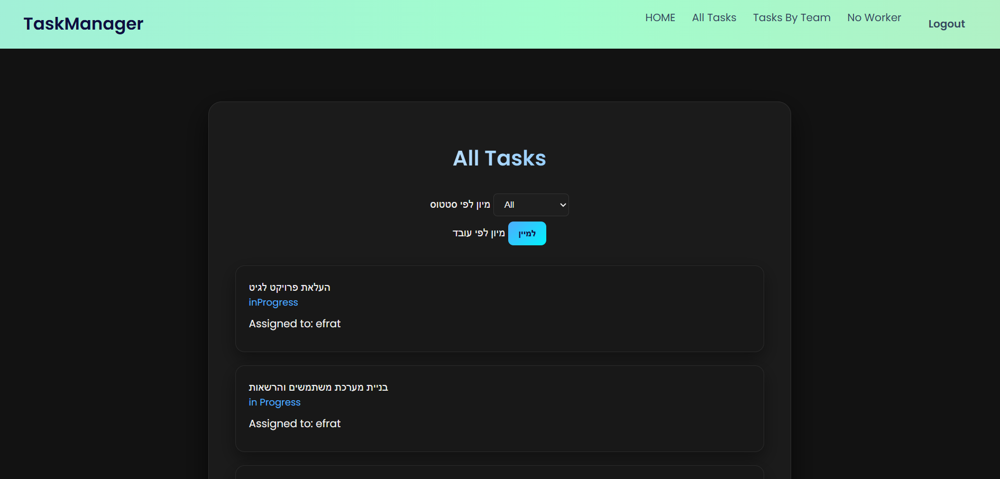
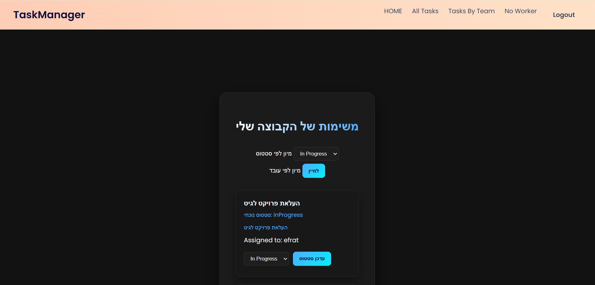
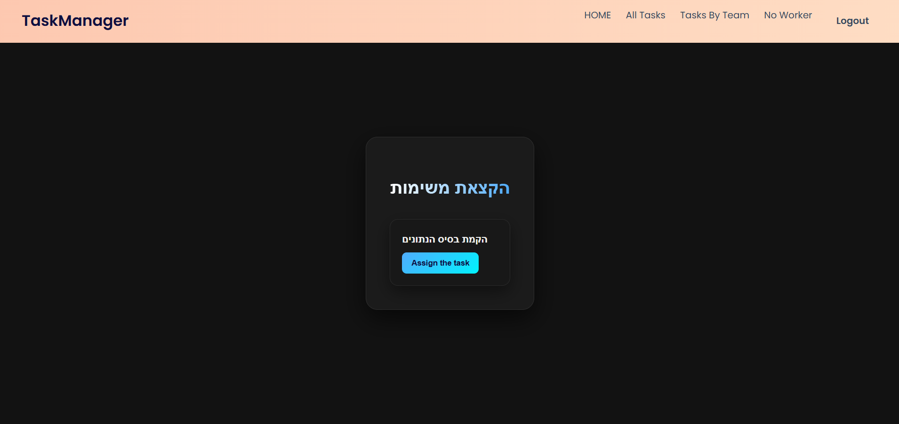
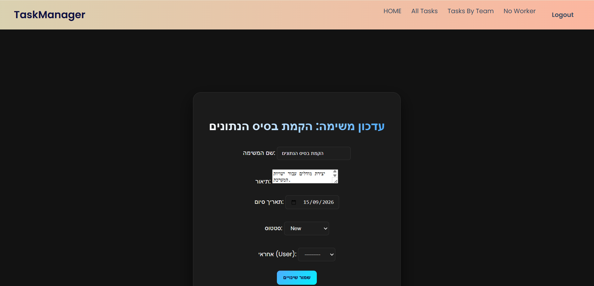

# Team Project - Task Management System

## Demo


---

## Overview

**Team Project** is a Django-based web application designed to help teams organize and manage tasks efficiently.

The system allows users to register, log in, manage their profiles, work with teams, and handle tasks according to their roles.

The application includes a role-based system with two types of users:

* **Manager**
* **Employee**

Managers and employees can interact with tasks according to the permissions defined in the system.

---

## Features

### User Management

* User registration and login.
* Custom user model based on Django's `AbstractUser`.
* User profile management.
* Role management:

  * Manager
  * Employee

### Team Management

* Assign users to teams.
* Manage team members.
* Display tasks according to team association.

### Task Management

* Create new tasks.
* Update existing tasks.
* Assign tasks to employees.
* View all tasks.
* View tasks by team.
* View tasks assigned to the current user.
* Delete tasks without assigned users.
* Update task status:

  * New
  * In Progress
  * Done

### Task Filtering

* Filter tasks by their current status.
* Display tasks according to different views.

---

## Technologies Used

* Python
* Django
* SQLite
* HTML
* CSS
* Git & GitHub

---

## Screenshots

### Home Page



### Login Page



### Registration Page



### All Tasks



### Tasks By Team



### Task Assignment



### Update Task



---


## Installation

### Clone the repository

```bash
git clone YOUR_REPOSITORY_URL
```

### Navigate to the project folder

```bash
cd TeamProject
```

### Create a virtual environment

```bash
python -m venv venv
```

### Activate the virtual environment

Windows:

```bash
venv\Scripts\activate
```

Linux / macOS:

```bash
source venv/bin/activate
```

### Install project dependencies

```bash
pip install -r requirements.txt
```

### Apply database migrations

```bash
python manage.py migrate
```

### Create an administrator account

```bash
python manage.py createsuperuser
```

### Run the development server

```bash
python manage.py runserver
```

Open your browser:

```
http://127.0.0.1:8000/
```

---

## Project Structure

```
DjangoProject/
│
├── DjangoProject/
│   ├── settings.py
│   ├── urls.py
│   └── project configuration files
│
├── TeamProject/
│   ├── models.py
│   ├── views.py
│   ├── forms.py
│   ├── urls.py
│   ├── templates/
│   └── static/
│
├── screenshots/
│
├── manage.py
├── requirements.txt
├── .gitignore
└── README.md
```

---

## Database

The project uses SQLite as the development database.

The database file (`db.sqlite3`) is not included in the repository because it contains local data.

A new database can be created by running:

```bash
python manage.py migrate
```

---

## Future Improvements

* Add task priority levels.
* Add notifications for assigned tasks.
* Improve the user interface design.
* Add more advanced permission management.
* Deploy the application to a production environment.

---

## Version Control

The project is managed using Git and GitHub.

The repository includes:

* Source code
* Project configuration files
* Requirements file
* Documentation

Sensitive and local files are excluded using `.gitignore`.

---

## Author

Developed as a student project using Django.
